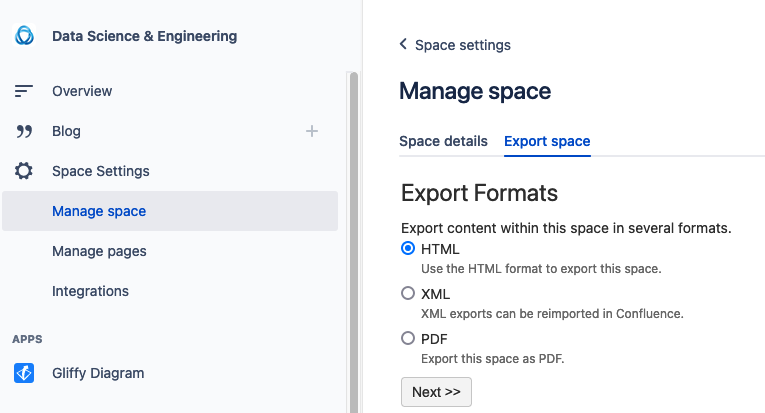

# Atlassian Wiki to Markdown via Pandoc

Dependencies: [pandoc](https://pandoc.org)

Step 1: export Wiki Space from Atlassian

Step 2: Download the zip

Step 3: Unzip the zip file to this directory

    unzip ~/Downloads/Confluence-space-export-190037.html.zip

Make a note of the directory unzipped: eg: `DE`.

Step 4: Run `convertwiki.py`

		./convertwiki.py --indir DE --outdir DE.wiki

NOTES:

1. Use `replace.json` to replace strings that you don't want in the new markdown files.
2. Enhance `fitler.lua` to fit your needs. Refer to [Pandoc Lua Filters](https://pandoc.org/lua-filters.html) documentation.
